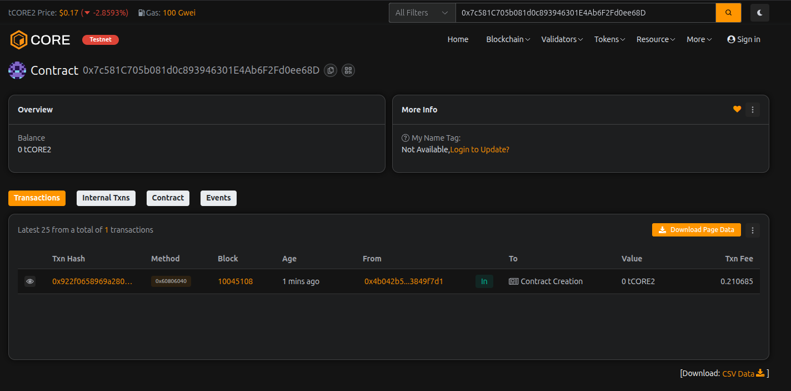

# VaultGate Protocol

## Project Description

VaultGate Protocol is a secure, decentralized vault management system built on the Ethereum blockchain. It provides users with a robust mechanism to lock and manage their digital assets with time-based security features. The protocol enables users to create personal vaults, deposit funds, and set custom lock periods to prevent premature withdrawals, ensuring enhanced security and disciplined asset management.

The smart contract implements a sophisticated access control system with role-based permissions, allowing administrators to authorize trusted users for emergency operations while maintaining the integrity of individual vault ownership. Each vault operates independently with customizable lock times, making it ideal for savings goals, inheritance planning, or general asset security.

## Project Vision

Our vision is to revolutionize digital asset security by providing a trustless, transparent, and user-friendly vault system that empowers individuals to take full control of their financial future. VaultGate Protocol aims to:

- **Promote Financial Discipline**: Enable users to lock assets for predetermined periods, helping them achieve long-term financial goals
- **Enhance Security**: Provide military-grade security through time-locks and multi-signature authorization
- **Democratize Access**: Make sophisticated vault management accessible to everyone, regardless of technical expertise
- **Build Trust**: Operate on transparent, immutable smart contracts that eliminate the need for intermediaries
- **Foster Innovation**: Create a foundation for advanced DeFi applications including scheduled payments, vesting schedules, and decentralized estate planning

## Key Features

### 1. **Personal Vault Creation**
Create your own secure vault with customizable lock periods, ensuring your assets remain protected until the designated unlock time.

### 2. **Flexible Deposit System**
Add funds to your vault at any time without affecting the lock period, allowing continuous accumulation of assets.

### 3. **Time-Locked Withdrawals**
Withdraw funds only after the lock period expires, preventing impulsive decisions and ensuring long-term asset protection.

### 4. **Lock Time Extension**
Extend your vault's lock period at any time to adapt to changing financial goals and security requirements.

### 5. **Role-Based Access Control**
Advanced authorization system allows administrators to grant special privileges to trusted users for emergency scenarios.

### 6. **Emergency Withdrawal**
Authorized users can access their funds even during lock periods in genuine emergencies, providing flexibility when needed most.

### 7. **Comprehensive Vault Monitoring**
Real-time visibility into vault balance, lock status, remaining time, and creation date for complete transparency.

### 8. **Protocol Statistics**
Track total vaults created, total value locked, and system parameters for full protocol insights.

### 9. **Configurable Parameters**
Administrators can adjust minimum lock periods to adapt to changing market conditions and user needs.

### 10. **Event Logging**
Complete audit trail of all vault operations through blockchain events for transparency and accountability.

## Future Scope

### Phase 1: Enhanced Features
- **Multi-Token Support**: Extend vault functionality to support ERC-20 tokens, stablecoins, and NFTs
- **Partial Withdrawals**: Allow users to withdraw specific percentages or amounts before full unlock
- **Recurring Deposits**: Implement automated, scheduled deposits for dollar-cost averaging strategies
- **Vault Sharing**: Enable multiple beneficiaries with customizable distribution rules

### Phase 2: Advanced Functionality
- **Yield Generation**: Integrate with DeFi protocols to generate passive income on locked assets
- **Governance System**: Implement DAO governance for protocol upgrades and parameter changes
- **Insurance Integration**: Partner with DeFi insurance protocols to protect vault assets
- **Cross-Chain Support**: Deploy on multiple blockchain networks for broader accessibility

### Phase 3: Enterprise Solutions
- **Corporate Treasury Management**: Tools for businesses to manage operational funds with approval workflows
- **Payroll Vaults**: Automated salary distribution with vesting schedules
- **Inheritance Planning**: Legal framework integration for digital asset inheritance
- **Compliance Features**: KYC/AML integration for institutional adoption

### Phase 4: Ecosystem Expansion
- **Mobile Application**: Native iOS and Android apps for seamless vault management
- **Social Recovery**: Implement social recovery mechanisms for account access restoration
- **AI-Powered Analytics**: Smart recommendations for optimal lock periods based on market conditions
- **DeFi Integrations**: Connect with lending platforms, DEXs, and other DeFi primitives

## Contract Details:

Transaction id: 0x7c581C705b081d0c893946301E4Ab6F2Fd0ee68D
